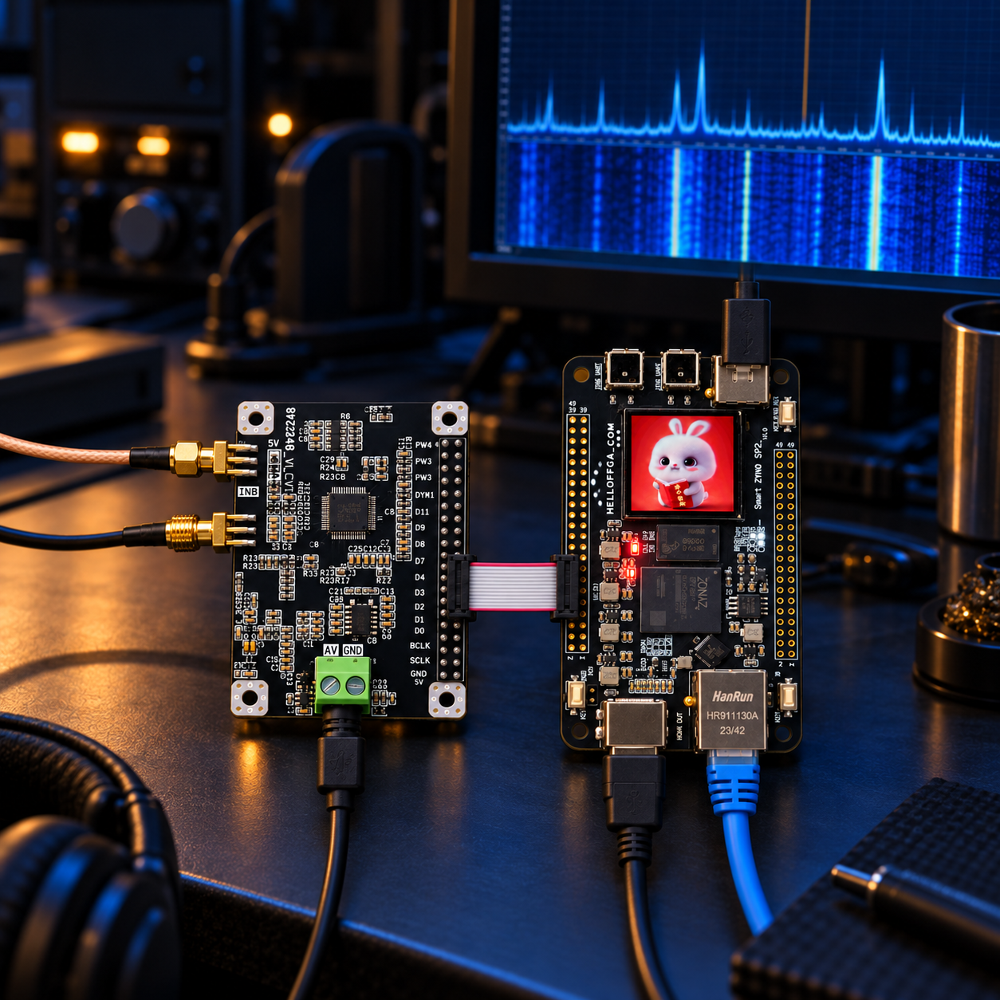
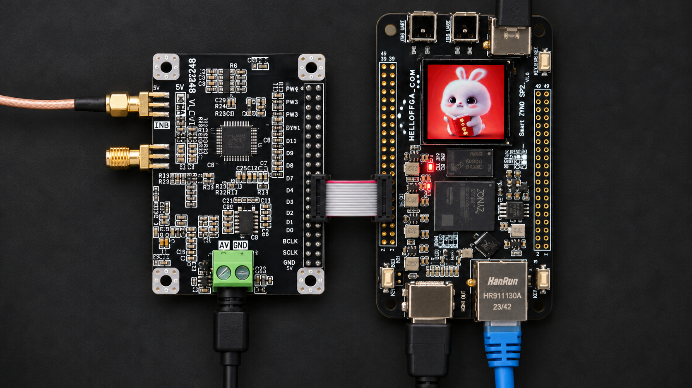
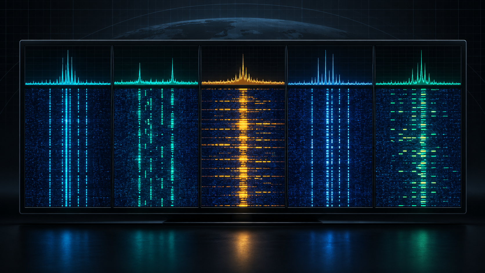
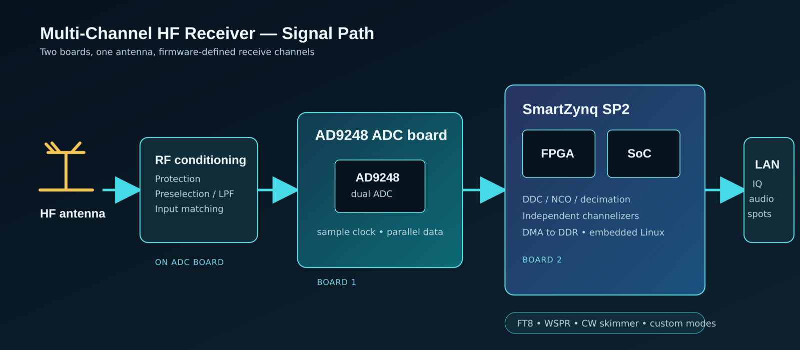

# HF Multi-Channel Receiver with Two Commercial Boards



## Overview

**HF Hydra** is a firmware-defined, multi-channel HF receiver built around just two readily available boards: an **AD9248 ADC board** ([AD9248.pdf datasheet](https://www.analog.com/media/en/technical-documentation/data-sheets/ad9248.pdf)) and a **SmartZynq SP2** (http://www.hellofpga.com/index.php/2024/01/21/smart-zynq-sp2/). 

Flash the firmware, connect an antenna, power it up, and it becomes a networked receiver that can watch several digital-mode frequencies at the same time.

Rather than dedicating a receiver to one band or one mode, HF Hydra digitizes the incoming signal and creates independent receive slices in the FPGA. One instance can follow FT8 activity on several amateur bands, keep a WSPR channel running in the background, or be reassigned to other narrowband experiments without hardware changes.

The project goal is deliberately simple: no custom RF board, no hand-built high-speed interface, no maze of dependencies. Buy the two boards, install the image, connect the antenna, and start receiving.

## Architecture

The initial programmable-logic design targets the SmartZynq SP2's XC7Z020. It captures a single AD9226 receiver channel and can substitute a deterministic, FT8-like virtual RF source for development and simulation.

```text
SmartZynq SP2 / XC7Z020
│
├─ AD9226 receiver
│  ├─ One channel, 12-bit parallel CMOS
│  ├─ 64 MS/s sampling clock generated by PL
│  └─ Captured in the ADC clock domain
│
├─ Digital downconverter
│  ├─ VFO: 1 to 30 MHz, 1 Hz tuning resolution
│  ├─ Complex I/Q mixing
│  ├─ Decimation: 64 MS/s → 8 ksample/s complex I/Q
│  ├─ Passband: ±2.0 kHz
│  └─ FIR target: ≤0.5 dB ripple, ≥50 dB stop-band rejection
│
├─ FT8 virtual-RF test source
│  ├─ Selectable instead of live ADC samples by PS command
│  ├─ Synthesized at 64 MS/s before the DDC
│  ├─ RF frequency: 1 to 30 MHz, selectable in 1 kHz steps
│  ├─ Default simulation: 14 MHz RF, DDC tuned 1 kHz below it
│  ├─ FT8: 8-GFSK, 79 symbols, 6.25 baud
│  ├─ TX duration: 12.64 s
│  └─ START_FT8 repeats every 15 s until STOP_FT8
│
├─ Xillybus / PS
│  ├─ FPGA → PS: 8 ksample/s complex I/Q stream
│  ├─ PS → FPGA: commands and FT8 tone/message configuration
│  ├─ PS NTP-synchronized C++ sends START_FT8 at a 15-second boundary
│  ├─ C++ records, decodes, and validates the generated FT8 message
│  └─ C++ monitors counters, timestamps, source state, and overflow flags
│
├─ Audio
│  ├─ I/Q monitor → 6× interpolation → 48 ksample/s
│  ├─ PL I²S transmitter to external 3.3 V DAC
│  ├─ MCLK 12.288 MHz, BCLK 3.072 MHz, LRCLK 48 kHz
│  ├─ SET_VOLUME with click-free gain ramp
│  └─ Audio source selection: I, Q, or mute
│
└─ Future HDMI option
   ├─ PL-generated waterfall, spectrum, VFO, FT8 state, decoded text
   ├─ Verify SP2 TMDS pinout/schematic first
   ├─ Video-only is the first HDMI milestone
   └─ HDMI audio is optional; I²S stays the baseline audio output
```

## Control commands

| Command | Purpose |
| --- | --- |
| `SET_VFO_HZ` | Set the DDC VFO frequency in hertz. |
| `SET_SOURCE` | Select `ADC` or `virtual-RF-FT8` input samples. |
| `SET_FT8_RF_HZ` | Set virtual FT8 RF frequency. |
| `SET_FT8_MESSAGE` / `LOAD_FT8_TONES` | Configure the FT8 payload or symbol tones. |
| `START_FT8` | Start 15-second-period FT8 transmissions. |
| `STOP_FT8` | Stop virtual FT8 transmissions. |
| `SET_GAIN` | Set receive-path gain. |
| `SET_VOLUME` | Set audio gain using a click-free ramp. |
| `SET_AUDIO_SOURCE` | Select I, Q, or mute audio monitoring. |
| `READ_STATUS` | Read counters, timestamps, source state, and overflow flags. |

## Details

### One small station, many listeners



The AD9248 board is the acquisition end: antenna input conditioning and high-speed conversion. The SmartZynq SP2 is the processing end: it receives the sample stream, runs the digital signal processing pipeline in programmable logic, and provides the operating system and network interface.

The firmware turns a single digitized RF/IF stream into a set of configurable receive channels. Each channel has its own digital oscillator, filter, decimator, and output stream. This makes the hardware reusable: choose the frequencies in configuration instead of rewiring a receiver.

The intended first-use flow is:

1. Flash the supplied SD-card image or firmware bundle.
2. Connect the ADC board to the SmartZynq SP2 and attach the antenna.
3. Connect power and Ethernet.
4. Select a preset—such as multi-band FT8, WSPR monitoring, or a custom channel plan.

### Channels are software, not hardware



The FPGA performs the repetitive high-rate work close to the ADC: digital down-conversion, filtering, and decimation. The processor side packages lower-rate IQ or audio streams for a local decoder, a network client, or logging software.

Example channel plans:

| Preset | Example allocation |
| --- | --- |
| FT8 watcher | One receive slice per selected amateur band |
| WSPR beacon monitor | Persistent WSPR slices plus spare experimental channels |
| Mixed digital bench | FT8, WSPR, CW/skimmer, and a general-purpose IQ stream |

Actual simultaneous channel count, usable coverage, and dynamic range will be documented from measured firmware builds. Input filtering and antenna protection remain important, especially with strong nearby transmitters.

### Why these two boards?

The AD9248 provides fast dual-channel conversion, while the SmartZynq SP2 pairs FPGA fabric—ideal for many parallel DDCs—with an embedded processor that can boot, configure the receiver, and serve results over Ethernet. Together they move the difficult hardware work into a repeatable two-board assembly and leave experimentation to firmware.

## Block diagram



The antenna enters the ADC board, where it is protected, filtered, and matched before conversion. Sample data crosses to the SmartZynq SP2, whose FPGA creates independent digital channels. The SoC then exposes those channels as IQ, audio, or decoded/spot data over the network.

---

### Project status

Architecture and project presentation are in place. Next milestones: validate the ADC interface, publish a repeatable firmware image, characterize RF performance, and release channel presets and setup documentation.
